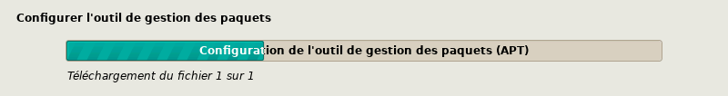

\title{Installation d'une distribution \emph{debian} sur ordinateur BIOS}
\author{F.S.G.}
\begin{titlepage}
	\maketitle
\end{titlepage}

\tableofcontents

<!--
Tout le code précédent est interprété pour la compilation LaTeX -> pdf
-->

# Avant de commencer

## Pourquoi ce document ?

Une expérience récente a montré que certains utilisateurs sont à la 
recherche d'une nouvelle distribution afin d'avancer dans les 
connaissances du fonctionnement du système et / ou acquérir d'autres.

Naturellement, lorsqu'un utilisateur commence avec une distribution 
Ubuntu ou l'un de ses dérivés, la continuation logique est d'aller 
explorer sa distribution mère : la vénérable _Debian_ GNU/Linux.

Dans les prochaines pages de ce document je vous propose un voyage 
avec l'installation de _Debian_ 11.2 sur un ordinateur standard en 
mode BIOS/Legacy ou équivalent.

Cette installation sera cependant quelque peu inusuelle : j'ai en 
effet opté pour une installation ayant une sécurité renforcée ce qui 
peut un jour ou l'autre s'avérer important. Cette partie sera abordée 
au moment du partitionnement du disque dans une des sections qui 
viendra ultérieurement.

Une version _pdf_ est disponible également sur cette page pour une 
impression fidèle à l'esprit et la graphie de cette production. Le 
document est initialement écrit en langage `Markdown` avec une 
exportation en _pdf_ via des feuilles de styles pour \LaTeX\ qui est 
un langage que j'aime énormément. Actuellement ce document contient
99 pages format A4.

Cette version A4-_pdf_ est volontairement créée avec de grandes 
marges afin de laisser l'espace autour du texte pour vos propres 
ajouts, vos correctifs ou autres notes personnelles, car autant 
j'aime les livres pour ce qu'ils ont en eux et ce qu'ils sont comme 
objet artistique intrinsèquement, autant j'apprécie aussi la 
possibilité offerte de pouvoir se les approprier par l'ajout de 
réflexions ou d'observations personnelles aux endroits nécessaires.

## Vérifications préalables

### Récupération du fichier **ISO**.

Évidemment, l'**ISO**[^iso] est à récupérer auparavant sur le site de 
debian : <https://www.debian.org>, mais prenez garde : le projet 
_Debian_ étant un projet libre, l'**iso** disponible sur le site ne 
contient aucun pilote ou librairie _non-libre_.

Lors de l'installation, l'**iso** proposée en téléchargement nécessite 
d'établir une connexion internet vers les dépôts officiels de cette 
distribution sur l'un des nombreux serveurs mirroirs répartis dans 
beaucoup de pays. Aussi, si les cartes réseaux de connexion (wifi et 
/ ou éthernet) utilisées pour l'installation ne possèdent pas de 
pilotes libres alors il est possible de télécharger une version 
spécifique de _Debian_ avec l'inclusion exceptionnelle de pilotes 
non-libres. L'iso est disponible à cet endroit :
<https://cdimage.debian.org/cdimage> et de choisir parmi les choix 
offerts **unofficial**.

Ce fichier **iso** contenant en plus des pilotes inclus dans la 
version officielle les pilotes non-libres, une plus grande partie de 
périphériques -- et plus généralement les pilotew wifi ou certains 
pilotes graphiques -- seront reconnus à l'installation et pourront 
permettre de la mener à bout.

**Petit conseil.** 
Même lorsque j'installe une debian j'aime prévoir la pire des 
situations et c'est pour cela que j'ai toujours un câble éthernet de 
longueur plus que suffisante afin de ne pas avoir à utiliser la 
version non-officielle avec les pilotes non-libres.

### Gravure de l'iso

La gravure de l'ISO ne devrait pas poser de problèmes en fonction du système d'exploitation que vous avez.

**Les utilisateurs et utilisatrices de MacOS.** Vous disposez dans les utilitaires (CTRL+u) d'un outil de gravure sur support d'un fichier ISO.

**Pour les utilisateurs et utilisatrices de Windows.** Il me semble que l'utilitaire "rufus" disponible : [ici](https://rufus.ie/fr/ "Rufus
 -- Créez facilement des clés USB démarrables") permet de créer facilement des clés USB démarrables.

**Pour les utilisateurs et utilisatrices de Linux et \*BSD.** L'outil intégré `dd` permet de graver facilement une image iso sur un support. 
Génériquement :

```bash
sudo dd status=progress if=/chemin/nom_du_fichier.iso of=/dev/peripherique
```
et par exemple si l'iso `debian-bidule.iso` se trouve dans le dossier `Téléchargements` et la clé usb à graver est situé dans `/dev/sdc` et que je suis dans mon dossier d'utilisateur alors la commande précédente devient :
```bash
sudo dd status=progess if=Téléchargements/debian-bidule.iso of=/dev/sdc
```
Suite à tout cela la clé est prête pour un démarrage.

### Petite recherche sur Internet

Évidemment pour de multiples raisons les ordinateurs ne démarrent pas sur clés USB mais directement sur le disque interne, aussi un petit tour sur internet avec le nom du modèle, de la marque et parfois aussi de la série vous permettra de trouver la *touche magique* qui orientera le démarrage vers le support USB et non sur le disque interne.

Extinction, branchement ... et c'est parti !

# Démarrage sur le futur ordinateur installé


Une fois le fichier _iso_ gravé sur le support et l'ordinateur 
démarré sur ce même support un premier écran s'affichera, celui de 
la capture précédente.

Comme vous le voyez, les images étant grandes et ne voulant pas 
surcharger inutilement tant la connexion internet si, comme je le 
présume, la page est consultée depuis un téléphone ou via une 
connexion limitée, j'ai décidé de retailler toutes les images qui 
suivront. Aussi toutes les captures qui suivent contiendront les 
éléments nécessaires à la compréhension des choix à effectuer pour 
une installation de nature similaire à celle que j'ai produite.

Je n'aime pas utiliser l'installation basique qu'elle soit textuelle 
(Install) ou qu'elle soit graphique (Graphical install) aussi je 
passe toujours par l'option (Advanced options).


Une fois l'option avancée choisie, pour les besoins de cette 
installation j'ai opté exceptionnellement pour pour l'installation en 
mode expert et graphique. Un accident totalement involontaire a 
cependant fait échouer avant la fin l'installation et, par habitude, 
la seconde installation identique, s'est faite en mode textuel, aussi 
les dernières captures d'écran seront différentes de celles du début.

Après quelques secondes une fois le choix effectué l'écran de la 
capture suivant apparaît.


Cette capture nous montre la voie à suivre et les différentes étapes 
qui seront parcourrues pendant l'installation. Pour choisir un des 
items dans l'une des différentes étapes il suffit de se déplacer avec 
les flèches directionnelles du clavier ou avec la souris lors d'une 
installation graphique et pour choisir il suffit de valider par la 
touche entrée ou de cliquer sur le bouton \[continuer\] qui apparaît 
en bas à droite dans la plupart des captures d'écran.

La première partie sera évidemment de choisir la langue utilisée lors 
de l'installation. La langue anglaise est peut-être votre tasse de 
thé mais pas la mienne aussi ...

# La langue et les localisations

Mais commençons par le commencement. *Debian* gère de nombreuses 
langues officielles et régionales, aussi afin de pouvoir communiquer 
avec nous, le programme d'installation nous demande d'effectuer une 
sélection linguistique.


Même si j'aime bien la langue ce *Shakespear* et que je suis un 
incoditionnel *amante* de celle de *Cervantes* ... je préfère 
basculer vers la langue française et ainsi me faire plaisir, 
*Molière* ou *Racine* et tous les autres auteurs du passé ne m'en 
voudront pas de ne pas les citer tous et toutes.


La langue d'installation étant fixée, la suite consiste à choisir la 
localisation géographique, parmi les différents pays de langue 
francophone, je choisis évidemment la France ...


... il faut bien sûr fixer ensuite les locales, c'est-à-dire les 
paramètres régionaux du système futur.


Le système Linux admet plusieurs paramètres régionaux ce qui peut 
avoir son utilité dans certaines situations, ici le système qui est 
sur le point d'être installé n'aura pas besoin de ces ajouts aussi 
aucune case n'est cochée dans la capture suivante.


Arrivé(e) à ce stade la langue, le pays et la langue de l'interface 
est déterminée et fixée pour le reste de l'installation tout comme 
pour le futur système opératif.

# Les adaptations aux personnes handicapées

Le système GNU/Linux _Debian_ se voulant le plus ouvert et large, le 
support des dispositifs braille est inclus dès cette étape. Si aucun 
dispositif de la sorte n'est détecté -- ce qui est le cas dans mes 
configurations -- alors l'appui sur continuer ou sur entrée ne fait 
que passer à l'étape suivante ...


... celle de la configuration de la synthèse vocale. Également absent 
de mes ordinateurs, la validation ou la continuation aura un effet 
similaire à savoir le passage à l'étape ultérieure.


Je pense que comme aucun dispositif de la sorte n'est présent sur 
mon système, aucune assistance vocale à l'installation n'est alors 
proposée dans la seconde captures, c'est pour cela que le clic sur 
le bouton "Continuer" ne provoque rien d'autre que le passage à 
l'étape ultérieure.

# La configuration du clavier

Une fois tous ces paramètres fixés restent les paramètres du clavier. 


Clavier qui est automatiquement sélectionné en Français vu les locales 
paramétrées précédemment.


# Vérification du support d'installation

Avant de poursuivre, l'installateur se doit de vérifier l'intégrité 
du contenu du support. Un seul paquet impropre et tôt ou tard lors 
de l'installation, une erreur critique se manifestera et gèlera 
aussitôt la mise en place du système.


Les modules obligatoires pour poursuivre sont automatiquement cochés. 


Si tout va bien, ce magnifique message apparaîtra.


Tout est donc prêt pour continuer.

# Chargement des outils supplémentaires à l'installation


Comme le montre la capture précédente la ligne suivante sera 
sélectionnée pour charger les composants supplémentaires. Le message 
indique que lors d'une détection interne si des modules s'avèrent 
nécessaires ils seront automatiquement chargés. La liste proposée 
ne contient que les composants que le système ne détecte pas mais 
que l'utilisateur _sait_ être importants pour sa personnalisation.


Avant de poursuivre il peut être nécessaire d'insérer des modules 
autres que le système n'estime pas obligatoire. Par exemple si on 
décide qu'on va utiliser un mirroir d'installation local (donc non 
proposé : choose-mirror), ou bien si un des disques est chiffré et 
qu'on souhaite le conserver (crypto-dm-modules), ou encore si la 
machine a très peu de mémoire vive (lowmem) voir si on souhaite 
installer le minimum du minimum pour finir l'installation dans une 
seconde étape à distance (network-console) ...

Après avoir coché ou non certaines cases et aussi coché le bouton 
\[Continuer\] le chargement automatique des modules cochés 


Bien ! Nous sommes prêts, modules et pilotes chargés, à attaquer 
la suite des opérations avec la configuration du réseau.

# La partie réseau

Ici arrive la configuration cruciale pour la suite même si elle ne 
représente pas la partie la plus importante de cette production.


Cette étape commence par la détection du matériel réseau. Si cette 
dernière est reconnue alors s'affichera la capture suivante pour la 
configuration.


Si plusieurs cartes sont disponibles, une page intermédiaire va 
demander de choisir laquelle sera utilisée. Les cartes réseaux 
peuvent s'appeler de différentes façons :

- les cartes réseau filaires (ethernet) : les anciens noms sont eth0, eth1, etc... les nouveaux noms sont enpXsY où X et Y sont des chiffres dépendant des cartes, ou enoX, ou d'autres noms encore plus étranges.
- les cartes réseau sans-fil (wi-fi) : les anciens noms sont wlan0, wlan1, etc... les nouvelles s'appellent aussi wlpXsY où X et Y peuvent changer en fonction de la carte réseau et de l'ordinateur

Au final, lorsque la carte est choisie l'écran suivant va apparaître 
proposant la configuration automatique du réseau. Dans le cas où 
il n'y a pas besoin de jouer avec les paramètres, autant laisser le 
choix "oui".


**Attention :** si le choix est "non" alors il faudra savoir quelques 
éléments de configuration réseau à savoir :

- l'adresse du sous-réseau ethernet (souvent commençant par 192.168) 
- l'adresse dans ce sous-réseau qu'on souhaite attribuer à la machine 
- la passerelle de ce sous-réseau pour sortir vers Internet
- le masque de ce sous-réseau pour communiquer par défaut seulement au sein de ce sous-réseau (souvent 255.255.255.0)
- l'adresse IP du serveur de résolution des noms de domaines (DNS) qui souvent correspond à celui de la passerelle dans une connexion domestique.


Ensuite autant laisser les 3 secondes nécessaires au démarrage de 
la carte afin qu'elle soit parfaitement alimentée avant de détecter 
les connexions réseaux.


D'abord l'IP version 6 sera configurée automatiquement puis se sera 
le tour de l'IP version 4 d'être configurée automatiquement.


Le point suivant correspond à la configuration du nom de la machine 
cela semble futile pourtant tous les systèmes, même _Windows_ 
nécessite un nommage de chaque machine afin de leur permettre une 
communication intraréseau, par défaut _debian_ est proposé mais 
chacun et chacune peut proposer de qu'il veut dans la limite des 
caractères acceptés.


Pour parachever la configuration réseau il est important de préciser 
si c'est le cas, le nom du domaine dans lequel la machine est ou 
sera présente, si vous laissez vide aucun soucis (au pire cela se 
paramètre ultérieurement) puisque chez soi aucun nom particulier 
n'est donné au réseau (sauf situations exceptionnelles).


La configuration est finie, il est l'heure de passer à celle du ou 
des utilisateurs futurs de cette machine.

# Le ou les utilisateurs

Lorsqu'on installe un système _Debian_ par défaut ce qui est le 
cas dans celle détaillée au sein de ce document, il y a création 
de deux utilisateurs différents : "root" l'administrateur et 
un autre pour les usages basiques. La création de root est alors 
automatisée et ne peut être refusée.


En passant par les options avancées il nous est proposé de ne pas 
créer de root, _de facto_ l'utilisateur standard créé se voyait 
affublé de droits supplémentaires en faisant partie du groupe _sudo_ 
lui octroyant pour une grande partie les mêmes possibilités que 
l'adminisrateur root.


À cette étape sera demandé s'il faut protéger les mots de passe en 
utilisant le fichier `/etc/shadow`[^shadow] et s'il faut autoriser 
ou pas la connexion du compte root.

Si le compte root est autorisé, la création du compte utilisateur 
à une étape ultérieure n'inscrira pas cet utilisateur dans le groupe 
des administrateurs (`sudo`) par contre si le compte root n'est pas 
autorisé à se connecter alors l'utilisateur sera dans sudo.


Suite à quoi sera créé le compte root et le mot de passe sera 
demandé deux fois (notez qu'on peut le faire apparaître pour le 
vérifier à cet instant précis ça ne sera plus le cas ultérieurement.

vous aurez noté la présence d'une case à cocher pour _Afficher le 
mot de passe en clair_ ce qui est important à cet instant de 
l'installation surtout quand on ne connaît pas finement la gestion 
du clavier dans Linux.


À cette étape est demandé si un utilisateur standard est nécessaire, 
cette question apparaît lorsque le compte root a été précédemment 
été autorisé à se connecter car si ça n'avait pas été le cas, la 
création du compte utilisateur est obligatoire.


Suite à cette question, il faut évidemment rentrer le nom complet 
de l'utilisateur (nom, prénom, ce que vous voulez) ...


... puis le nom d'utilisateur au sens _UNIX_ du terme (pas d'accents, 
pas d'espaces, etc.), ce nom d'utilisateur s'utilisera principalement 
dans les terminaux en mode textuel pur ou en mode graphique.


Tout comme pour root, le mot de passe est masqué mais peut être 
rendu visible par l'activation de la casse idoine.

Le ou les comptes d'utilisateurs du futur système sont donc prêts à 
être installés le moment venu, il va falloir passer à l'étape 
suivante de configuration de l'horloge système ce qui revêt une 
certaine importance traitée au chapitre suivant.

# Réglage de l'horloge et du fuseau horaire.

Cette partie va s'avérer importante dans certains cas, pas tant pour 
l'utilisateur d'un poste de travail classique -- quoi que cela puisse 
avoir son importance -- mais il ne faut pas oublier que _Debian_ reste 
dans sa conception et son ADN une distribution orientée serveurs.

Or, afin que tous les serveurs partout dans le monde soient réglés 
comme il faut les machines fonctionnant sous Linux seul ont comme 
habitude de régler l'horloge matérielle de l'ordinateur sur le temps 
universel GMT et d'appliquer un décalage dû au fuseau horaire.


Une machine fonctionnant sous windows voit son heure matérielle dans 
le même fuseau horaire que celle du système, pas sous Linux (et sous 
macOS également).

D'ailleurs Microsoft (Windows) utilise lui aussi un service de temps 
pour la même chose mais il est rarement actif par défaut (de mémoire).

Afin d'assurer le bon réglage des heures les unes par rapport aux 
autres il est demandé s'il faut utiliser le service NTP[^ntp] pour 
synchroniser l'horloge du système.


Par défaut le choix étant "oui" la fenêtre suivante est proposée, 
elle utilise le serveur faisant tourner le service (côté serveur) 
pour effectuer les recalages.

Sauf si vous connaissez l'adresse exacte d'un serveur de temps, ne 
pas toucher à ce paramètre est judicieux.


Si la connexion s'établit vers le dit serveur, le fuseau horaire le 
plus proche entre vos réglages linguistiques, l'heure système et 
l'horloge matérielle sera proposé en plus du temps universel.


Ces réglages sont importants surtout pour la validité des certificats 
et des signatures cryptographiques utilisées par certains services et 
ou logiciels. Au moment de la fin de validité d'un tel document ou au 
début de la validité d'un autre, si l'horloge est mal réglée c'est

# Préparation du support


On va désormais se concentrer sur le support de la future installation 
*i.e.* le disque dur interne.

Dans ce document j'ai opté pour une installation chiffrée sauf le 
dossier `boot` qui sera quant à lui laissé à l'extérieur du 
chiffrement. C'est un choix délibéré de ma part car l'installateur 
basique ne permet pas mieux comme possibilité nativement, c'est-à-dire 
sans sortir de lui-même par l'exécution d'un script `bash`.

Dans les méthodes de chiffrement il existe pléthore de possibilités 
mais je préfère malgré tout l'utilisation d'une configuration 
relativement simple :

- un dossier `/boot` en clair pour le démarrage
- le reste du disque chiffré via `luks`.
	- dans le volume chiffré luks un *logical volume manager* (lvm)
		- dans ce `lvm` un groupe qui contiendra le système
			- dans ce groupe `/` *swap* et `/home`
- pas d'EFI évidemment

Concernant les variantes pour une machine avec EFI il y a un chapitre 
spécifique en annexe.

La première étape consiste donc à détecter le ou les disques présents 
au sein du système puisque Linux sait parfaitement gérer un système 
dispersé sur plusieurs disques.

S'exécute alors l'outil de partitionnement ...


... ce qui va nécessiter le chargement des composants utiles pour 
la gestion du chiffrement et des volumes logiciels...


... et le chargement de de l'outil graphique ou semi-graphique de 
partitionnement.


Plusieurs choix sont offerts.

- si vous n'y connaissez rien ou avez peu confiance en vos capacités, 
le premier choix "Assisté - utiliser un disque entier" est l'option 
la plus sûre et aussi la moins fine mai au moins vous aurez 
l'impression de facilité à l'installatino de la distribution _Debian_.
- le choix "Assisté - utiliser tout un disque avec LVM" et une option 
qui se rapproche de ce que je veux mettre en place, mais il manque le 
chiffrement protecteur que désire mettre en place.
- Ensuite le choix "Assisté - utiliser un disque avec LVM chiffré" est 
le choix qui se rapproche le plus de que je souhaite mettre en place. 
Il manque cependant une finesse dans le partitionnement comme la 
séparation des partitions utilisateur et racine ainsi qu'un meilleur 
contrôle du *swap*.

Aussi mon choix se portera concrètement sur `Manuel` me laissant 
plus grande autonomie et liberté dans la configuration.


Dans l'image sur la création d'une table de partionnement comme le 
disque est totalement neuf et non partitionné en usine, il n'y a 
aucune table déterminée.

Lorsque je crée une table de partition nouvelle sur un disque deux 
choix s'offrent à moi sur un disque fonctionnant dans un ordinateur 
de type PC, soit un partitionnement `msdos` ou `dos` soit un 
partitionnement `gpt`.


.")


# Installation du système de base sur la cible

Puisque le disque est partitionné et formaté comme souhaité il est 
désormais temps de passer à l'installation du squelette du futur 
sytème opératif. Ce squelette est désigné par le "système de base" 
dans l'installateur.


Pas grand chose à faire hormis exécuter l'étape d'installation 
puisque cette structure est parfaitement automatisée et installe 
les outils nécessaires à l'administration ou aux réparations d'un 
linux en place. L'utilisateur moyen ou son pendant féminin ne 
saura peut-être jamais que ces programmes existent.


Une question est posée cependant : quel noyau choisir dans ce 
système basique ? On pourrait avoir l'idée de dire aucun (mais je 
n'ai jamais testé), choisir un `linux-image-numéros-architecture` 
figera le noyau dans cette version malgré les mises à jour, par 
contre l'utilisation de la ligne `linux-image-architecture` comme 
sur la capture où on voit le fichier pour l'architecture `amd64` 
désignant les processeurs 64 bits (Intel, AMD ...) habituels sur 
PC.


Enfin il est posé la question concernant la liste des pilotes du 
noyau à installer. Dans le monde _Windows_ ces pilotes sont 
appelés _drivers_ et permettent de reconnaître du matériel. Sur un 
appareil fixe qui ne recevra aucun matériel supplémentaire on peut 
chosir la ligne "image ciblée", mais pour un ordinateur qui pourra 
recevoir des disques, des imprimantes, des scanners ou d'autres 
périphériques il est préférable de choisir "image générique" qui 
installera la totalité des pilotes du noyau disponibles.


Le système "de base étant prêt", désormais il va falloir configurer 
l'outil en charge d'installer des logiciels supplémentaire connu 
sous le nom de "getionnaire de paquets".

# Configuration de l'outil de gestion des paquets

L'outil de gestion des paquets est le programme utilisant une des 
méthodes d'installation des programmes. Linux en connaît quatre 
qui peuvent plus ou moins rangés en trois modes :

- installation d'un paquet :
	- par le gestionnaire des paquets (graphique / textuel)
	- manuellement (graphique / textuel)
	- via un *Store* comme sur téléphone mobile (graphique)
- exécution d'un binaire prêt-à-l'emploi (graphique / textuel)
- compilation des sources et installation manuellement (textuel)

Au moment de l'installation, _Debian_ va proposer de configurer 
l'outil de gestion des paquets (il n'y a pas de _Store_ dans le 
style d'un _Apple/Windows/Ubuntu store_) propre à cette distribution 
et qui se trouve également dans ses distributions filles.


Dans un premier temps il faut préciser si d'autres supports 
d'installation sont fournis. Par défaut avec l'image téléchargée 
ce n'est pas le cas, aussi la réponse "non" est présélectionnée et 
suffit amplement.


Je profite cependant pour rappeler que si j'ai choisi cette 
distribution ça n'est pas le fruit du hasard. _Debian_ fait partie 
des rares distributions entièrement disponible _off line_ et à ce 
titre en cas de chute mondiale du réseau internet pendant une durée 
assez longue pour avoir besoin de réinstaller un système opératif, 
alors il est possible d'avoir besoin des DVD de la distribution 
complète.

Dans ce cas, _Debian_ offre 4 DVD contenant la plus grande partie 
des logiciels disponibles et arrivé(e) à cette étape de 
l'installation il suffira de cocher **oui** et de suivre les 
étapes qui s'afficheront (principalement insérer les nouveaux DVD 
dans le lecteur, valider pour que le système les parcourre puis 
à la fin de la lecture de tous les DVD, remettre le premier pour 
poursuivre l'installation.





# Installation des logiciels initiaux

Au moment de l'installation est proposé de directement mettre sur le 
disque final une série de logiciels prêts à l'emploi afin de permettre 
à l'utilisateur d'avoir un environnement opérationnel et 
pré-paramétré par défaut.

Bien que beaucoup d'utilisateurs de *Debian* l'utilisent en mode 
serveur, l'installateur propose dès le début les plus classiques 
environnements graphiques et des outils divers tels que les outils 
bureautiques ou des navigateurs internet par défaut et installables 
par une simple coche de case.


C'est ce qui est proposé dans la ligne *Choisir et installer des logiciels.*

Une fois ce choix enclenché une phase de mise à jour -- d'où la 
nécessité de la connexion active -- commence afin de proposer 
l'installation immédiate de leurs dernières versions disponibles.


L'installateur propose aussi d'aller rechercher les mises à jour 
de sécurité des logiciels soit déjà installés par l'étape de création 
du système de base, soit des logiciels qui sont installés à cette 
étape-ci.


Une phase temporaire de téléchargements s'opère...


... suite à quoi il est demandé si l'on souhaite -- ou non -- 
participer aux remontées d'expérience et de *bugs* pour aider les 
programmeurs et / ou mainteneurs du projet dans l'amélioration des 
paquets logiciels concernés.


Après plusieurs téléchargements et mises à jour récupérées 
l'utilitaire *tasksel* est téléchargé ... puis commence à s'exécuter.


Cet outil, *tasksel* propose alors de cocher des **meta-paquets** qui 
sont des paquets de paquets, ou groupes de paquets si cela est plus 
clair, et dont le but est d'installer des environnements prêts à 
utiliser avec tout ce qu'il faut pour apprécier un système fonctionnel.


Une fois les cases cochées et la touche Continuer enfoncée c'est le 
moment où l'installation du système initial et de tous les paquets se fera sans qu'on ai besoin de quoi que ce soit.


Cette étape est la partie la plus longue de toute l'installation 
puisque dépendant de la quantité de paquets à télécharger suivant 
les cases du menu précédent choisies mais également du débit de la 
connexion internet utilisée pour récupérer l'intégralité de ces 
paquets.

Cette dépendance est principalement effective sur la première partie 
du processus : celle du téléchargement des logiciels.

Allez faire une promenade, ou préparer un gâteau ça peut être long.

Ne vous fiez pas à la barre de progression : la quantité totale des 
téléchargements correspond à 1/3 de la barre, le second tiers est 
l'installation des paquets suite à leur décompression et le dernier 
tiers est dédié au paramétrage initial de chaque paquet.

Une fois tous les paquets récupérés, ce qui fera la rapidité ou à 
contrario la lenteur de la progression seront les performances 
intrinsèques de la machine.

# L'installation du chargeur de démarrage

C'est à ce moment de l'installation que la coupure de courant a eu 
lieu par manque d'anticipation de ma part et un chargeur non branché 
à temps.

Aussi les captures suivantes sont issues de la 2e installation qui 
a suivi. Je n'ai pas opté cette fois-ci par habitude et réflexe à une 
installation en mode graphique experte mais en mode experte textuelle 
aussi pardonnerez-vous la différence de présentation des contenus des 
captures bien que les messages affichés soient les mêmes que ceux de 
l'installation experte graphique.


Par défaut depuis longtemps l'installateur est GRUB. Il prend en 
charge le démarrage et le lancement de de l'image de démarrage.

L'un des premiers travaux est de rechercher dans l'ordinateur les 
autres systèmes d'exploitation, tâche confiée à l'outil appelé 
'os prober'.

Comme l'installation s'est faite depuis un disque vierge sans autre 
système d'exploitation présent, la détection renvoie un résultat nul 
et le message suivant apparaît.


Une fois le message passé, ce nouveau message sera affiché, il 
demande à l'utilisateur d'indiquer un disque sur lequel sera installé 
la première partie de grub dans le MBR[^mbr] du disque. Si plusieurs 
disques sont présents il faut faire attention à ne pas se tromper.


Vient le moment de l'installation dédié à uEFI. Cette installation 
ayant été menée dans un système non-uEFI forcément ... pas besoin de 
ce forçage à effectuer.


<!--  image inutile car en double -->

L'installation de GRUB s'effectue alors dans le premier disque (`sda`) 
ce qui peut demander un petit moment.


Puis automatiquement le script de création et/ou mise-à-jour de la 
configuration de GRUB.


Ces deux phases sont totalement automatiques et une fois fini c'est la fin de l'installation qui s'annonce.

À ce stade la machine devient "démarrable" puisque GRUB est installé mais le noyau 
installé n'est pas optimisé pour l'ordinateur, cette adaptation sera faite lors de 
la phase finale qui suit.

# La phase finale de l'installation

On arrive à la fin du spectacle. Il ne reste plus qu'à paramétrer les utilisateurs 
et recréer une image propre pour le démarrage.

Le grand menu d'accueil nous indique d'ailleurs qu'on arrive à " Terminer 
l'installation " c'est tout dire. Et on valide !


Tous les paramètres saisis tout à l'heure sont mis en place maintenant : 
création des utilisateurs avec inscription de l'utilisateur standard dans 
le groupe _sudo_ si le compte **root** n'est pas activé.


Vient ensuite l'exécution du script `hw-detect` dont le nom est suffisamment 
clair pour supposer qu'il est là pour détecter le matériel spécifiquement. Je 
pense qu'il sert dans l'étape de compilation de l'initramfs à venir plus loin.


Puis une fois ceci effectué l'installateur demande si l'horloge matérielle 
est déjà en UTC (par exemple si l'ordinateur utilisait déjà un système 
Linux ou UNIX) ou pas afin de correctement synchroniser l'heure système 
et l'heure matérielle.


Avant que le système soit pleinement opérationnel il reste une phase 
automatique qui est la génération de l'image initiale au démarrage. 
Il faut comprendre qu'un système Linux est très particulier sur sa 
phase de démarrage : en effet un micro-système non-interactif est 
exécuté au tout début, ce système ayant pour charge de vérifier 
l'intégrité du système à venir, il est de très petite taille mais 
doit contenir l'essentiel pour accomplir sa tâche.

Ce système est appelé _initramfs_ ou encore _initcpio_ et il est 
généré dans les distributions de type _debian_ par la commande :

`update-initramfs -k all -u`

Si les options diffèrent un peu -- et sûrement -- lors de 
l'installation, c'est quand même cet outil qui es exécuté à ce 
moment de l'installateur.

C'est dans cette étape que sont à mon avis utilisées les informations 
récupérées par le script `hw-detect` aux étapes précédentes.


Pour finir enfin, la dernière étape vous signaler la démarche à suivre 
dans ce dernier message.


Voilà ! Vous êtes prêt(e) à utiliser ce système fraîchement installé 
et qui je l'espère vous ouvrira de nouvelles aventures dans le monde 
du libre et de Linux.

Amusez-vous bien !

# Le démarrage qui suit

Les pages qui suivent vont montrer quelques captures d'écran du 
résultat obtenu. Comme l'installation est relativement minimaliste 
aussi GRUB est-il en version textuelle et non graphique. Il reste 
évidemment paramétrable en allant chercher les fichiers idoine.

L'écran devrait ressembler à celui qui suit (j'ai inversé les 
couleurs de la zone autour du rectangle bleu central)


Très rapidement après la disparition de l'écran précédent et vu que 
le disque dur est chiffré, le mot de passe est à saisir (la capture 
d'écran est en couleurs inversées pour économiser l'encre). Il y a 
par défaut 3 tentatives autorisées avant que le système ralentisse 
l'accès.


Plusieurs lignes apparaîtront avec le démarrage de plusieurs services, 
tant que des OK, ou de INFO apparaissent tout va bien, attention dans 
le cas des WARN (orange) et surtout s'il y a des FAILED (rouge) 
visibles il faudra agir.

La capture d'écran suivante est en couleurs inversées aussi.


Arrivera alors l'écran d'identification et d'authentification le plus 
simple possible.


Voici le bureau obtenu ensuite avec l'explorateur de fichiers à gauche 
et un terminal à droite.


Le bureau vide de LXDE sur debian 11.2 :


Pour finir : les messages d'extinction en couleurs inversées afin 
d'économiser aussi l'encre..


# Quelques informations légales

Toute cette installation a été réalisée avec l'outil virtualbox 
présent dans la distribution Linux Ubuntu 22.04 en pré-version (car 
elle ne sortira que dans deux mois officiellement). Vous me direz que 
c'est paradoxal d'utiliser une autre distribution et je vous dirai 
que cela l'est mais que cet ordinateur utilisé avec Ubuntu est dédié 
à un membre de ma famille qui va justement débuter sous Linux et que 
ce fût aussi l'occasion pour moi de réutiliser cette distribution que
j'avais oublié depuis longtemps.

Mon avis sur Ubuntu ? Je vous le partagerai ultérieurement car lorsque 
j'ai divergé de son utilisation en 2010 c'était pour des raisons qui 
sont encore d'actualité -- donc vous avez mon avis -- et son évolution 
bien qu'honnorable ne correspond pas ou plus à mes besoins.

Les captures d'écran ont été réalisées avec l'outil intégré à 
virtualbox et retouchées ensuite une à une avec kolourpaint car pour 
réduire les espaces de façon différente pour chaque image il ne 
pouvait être question de faire un traitement par lot.

La saisie du code source du document en langage `Markdown` a été 
effectuée sur le bloc-notes _mousepad_ dans l'environnement graphique 
XFce4. L'exportation dans des formats autres (html, pdf) provient de 
l'emploi de l'utilistaire _pandoc_ en version 2.9.2.1.

---

[^iso]: Format de fichier contenant une _image_ sorte de photographie 
virtuelle d'un disque ou d'un autre support afin de pouvoir générer 
la copie exacte du même support non pas fichier par fichier mais piste 
par piste plaçant ainsi chaque morceau de fichier exactement au même 
endroit.

[^mbr]: MBR = Master Boot Record. C'est la zone du disque placée à son 
début qui est utilisée pour indiquer au système où se trouve le 
système d'exploitation. Ceci est caractéristique des systèmes BIOS. Un 
autre système existe dans les machines en uEFI.

[^ntp]: Network Time Protocole

[^shadow]: Aux premiers temps du système UNIX et donc par essence, 
Linux le fichier `/etc/passwd` contenait les mots de passes des 
utilisateurs _en clair_. Évidemment cela posait de sérieux problèmes 
en cas d'accès au système. Dans l'optique d'une sécurité accrûe, il 
fût mis en place le fichier `/etc/shadow` qui contient un _hash_ du 
mot de passe, non plus le mot de passe lui-même, permettant ainsi de 
sécuriser plus cette authentification.