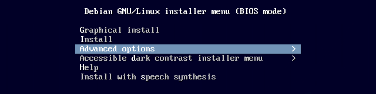
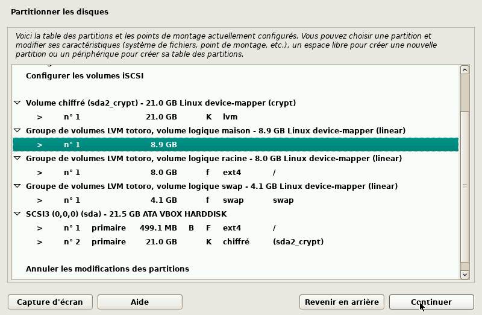
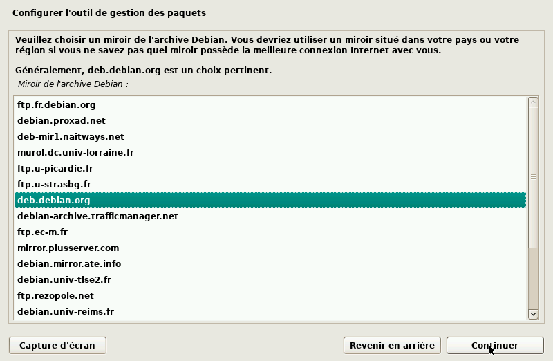
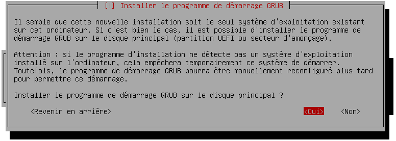

\title{Installation d'une distribution \emph{debian} sur ordinateur BIOS}
\author{F.S.G.}
\begin{titlepage}
	\maketitle
\end{titlepage}

\tableofcontents

<!--
Tout le code précédent est interprété pour la compilation LaTeX -> pdf
-->

# Avant de commencer

## Pourquoi ce document ?

Une expérience récente a montré que certains utilisateurs sont à la 
recherche d'une nouvelle distribution afin d'avancer dans les 
connaissances du fonctionnement du système et / ou acquérir d'autres.

Naturellement, lorsqu'un utilisateur commence avec une distribution 
Ubuntu ou l'un de ses dérivés, la continuation logique est d'aller 
explorer sa distribution mère : la vénérable _Debian_ GNU/Linux.

Dans les prochaines pages de ce document je vous propose un voyage 
avec l'installation de _Debian_ 11.2 sur un ordinateur standard en 
mode BIOS/Legacy ou équivalent.

Cette installation sera cependant quelque peu inusuelle : j'ai en 
effet opté pour une installation ayant une sécurité renforcée ce qui 
peut un jour ou l'autre s'avérer important. Cette partie sera abordée 
au moment du partitionnement du disque dans une des sections qui 
viendra ultérieurement.

Une version _pdf_ est disponible également sur cette page pour une 
impression fidèle à l'esprit et la graphie de cette production. Le 
document est initialement écrit en langage `Markdown` avec une 
exportation en _pdf_ via des feuilles de styles pour \LaTeX\ qui est 
un langage que j'aime énormément. Actuellement ce document contient
86 pages format A4.

## Vérifications préalables

### Récupération du fichier **ISO**.

Évidemment, l'**ISO**[^iso] est à récupérer auparavant sur le site de 
debian : <https://www.debian.org>, mais prenez garde : le projet 
_Debian_ étant un projet libre, l'**iso** disponible sur le site ne 
contient aucun pilote ou librairie _non-libre_.

Lors de l'installation, l'**iso** proposée en téléchargement nécessite 
d'établir une connexion internet vers les dépôts officiels de cette 
distribution sur l'un des nombreux serveurs mirroirs répartis dans 
beaucoup de pays. Aussi, si les cartes réseaux de connexion (wifi et 
/ ou éthernet) utilisées pour l'installation ne possèdent pas de 
pilotes libres alors il est possible de télécharger une version 
spécifique de _Debian_ avec l'inclusion exceptionnelle de pilotes 
non-libres. L'iso est disponible à cet endroit :
<https://cdimage.debian.org/cdimage> et de choisir parmi les choix 
offerts **unofficial**.

Ce fichier **iso** contenant en plus des pilotes inclus dans la 
version officielle les pilotes non-libres, une plus grande partie de 
périphériques -- et plus généralement les pilotew wifi ou certains 
pilotes graphiques -- seront reconnus à l'installation et pourront 
permettre de la mener à bout.

**Petit conseil.** 
Même lorsque j'installe une debian j'aime prévoir la pire des 
situations et c'est pour cela que j'ai toujours un câble éthernet de 
longueur plus que suffisante afin de ne pas avoir à utiliser la 
version non-officielle avec les pilotes non-libres.

### Gravure de l'iso

# Démarrage sur le futur ordinateur installé

Une fois le fichier _iso_ gravé sur le support et l'ordinateur 
démarré sur ce même support un premier écran s'affichera, celui de 
la capture qui suit.

Comme vous le voyez, les images étant grandes et ne voulant pas 
surcharger inutilement tant la connexion internet si, comme je le 
présume, la page est consultée depuis un téléphone ou via une 
connexion limitée, j'ai décidé de retailler toutes les images qui 
suivront. Aussi toutes les captures qui suivent contiendront les 
éléments nécessaires à la compréhension des choix à effectuer pour 
une installation de nature similaire à celle que j'ai produite.

Je n'aime pas utiliser l'installation basique qu'elle soit textuelle 
(Install) ou qu'elle soit graphique (Graphical install) aussi je 
passe toujours par l'option (Advanced options).

Une fois l'option avancée choisie, pour les besoins de cette 
installation j'ai opté exceptionnellement pour pour l'installation en 
mode expert et graphique. Un accident totalement involontaire a 
cependant fait échouer avant la fin l'installation et, par habitude, 
la seconde installation identique, s'est faite en mode textuel, aussi 
les dernières captures d'écran seront différentes de celles du début.

Après quelques secondes une fois le choix effectué l'écran de la 
capture suivant apparaît.

Cette capture nous montre la voie à suivre et les différentes étapes 
qui seront parcourrues pendant l'installation. Pour choisir un des 
items dans l'une des différentes étapes il suffit de se déplacer avec 
les flèches directionnelles du clavier ou avec la souris lors d'une 
installation graphique et pour choisir il suffit de valider par la 
touche entrée ou de cliquer sur le bouton \[continuer\] qui apparaît 
en bas à droite dans la plupart des captures d'écran.

La première partie sera évidemment de choisir la langue utilisée lors 
de l'installation. La langue anglaise est peut-être votre tasse de 
thé mais pas la mienne aussi ...

# La langue et les localisations

... je préfère basculer vers la langue française.

La langue d'installation étant fixée, la suite consiste à choisir la 
localisation géographique, parmi les différents pays de langue 
francophone, je choisis évidemment la France ...

... il faut bien sûr fixer ensuite les locales, c'est-à-dire les 
paramètres régionaux du système futur.

Le système Linux admet plusieurs paramètres régionaux ce qui peut 
avoir son utilité dans certaines situations, ici le système qui est 
sur le point d'être installé n'aura pas besoin de ces ajouts aussi 
aucune case n'est cochée dans la capture suivante.

# Les adaptations aux personnes handicapées

Le système GNU/Linux _Debian_ se voulant le plus ouvert et large, le 
support des dispositifs braille est inclus dès cette étape. Si aucun 
dispositif de la sorte n'est détecté -- ce qui est le cas dans mes 
configurations -- alors l'appui sur continuer ou sur entrée ne fait 
que passer à l'étape suivante ...

... celle de la configuration de la synthèse vocale. Également absent 
de mes ordinateurs, la validation ou la continuation aura un effet 
similaire à savoir le passage à l'étape ultérieure.

# La configuration du clavier

Une fois tous ces paramètres fixés restent les paramètres du clavier. 

Clavier qui est automatiquement sélectionné en Français vu les locales 
paramétrées précédemment.

# Vérification du support d'installation

Avant de poursuivre, l'installateur se doit de vérifier l'intégrité 
du contenu du support.

Les modules obligatoires pour poursuivre sont automatiquement cochés. 

Si tout va bien, ce magnifique message apparaîtra.

Tout est donc prêt pour continuer.

# Chargement des outils supplémentaires à l'installation

Comme le montre la capture qui suit la ligne suivante sera 
sélectionnée pour charger les composants supplémentaires. Le message 
indique que lors d'une détection interne si des modules s'avèrent 
nécessaires ils seront automatiquement chargés. La liste proposée 
ne contient que les composants que le système ne détecte pas mais 
que l'utilisateur _sait_ être importants pour sa personnalisation.

Avant de poursuivre il peut être nécessaire d'insérer des modules 
autres que le système n'estime pas obligatoire. Par exemple si on 
décide qu'on va utiliser un mirroir d'installation local (donc non 
proposé : choose-mirror), ou bien si un des disques est chiffré et 
qu'on souhaite le conserver (crypto-dm-modules), ou encore si la 
machine a très peu de mémoire vive (lowmem) voir si on souhaite 
installer le minimum du minimum pour finir l'installation dans une 
seconde étape à distance (network-console) ...

Après avoir coché ou non certaines cases et aussi coché le bouton 
\[Continuer\] le chargement automatique des modules cochés 

# La partie réseau

Ici arrive la configuration cruciale pour la suite même si elle ne 
représente pas la partie la plus importante de cette production.

# Le ou les utilisateurs

# Réglage de l'horloge et du fuseau horaire.

Cette partie va s'avérer importante dans certains cas, pas tant pour l'utilisateur 
d'un poste de travail classique -- quoi que cela puisse avoir son importance -- 
mais il ne faut pas oublier que _Debian_ reste dans sa conception et son ADN une 
distribution orientée serveurs.

Or, afin que tous les serveurs partout dans le monde soient réglés comme il faut 
les machines fonctionnant sous Linux seul ont comme habitude de régler l'horloge 
matérielle de l'ordinateur sur le temps universel GMT et d'appliquer un décalage 
dû au fuseau horaire.

Une machine fonctionnant sous windows voit son heure matérielle dans le même 
fuseau horaire que celle du système, pas sous Linux (et sous macOS également).

D'ailleurs Microsoft (Windows) utilise lui aussi un service de temps pour la même 
chose mais il est rarement actif par défaut (de mémoire).

Afin d'assurer le bon réglage des heures les unes par rapport aux autres il est 
demandé s'il faut utiliser le service NTP[^ntp] pour synchroniser l'horloge du 
système.

Par défaut le choix étant "oui" la fenêtre suivante est proposée, elle utilise le 
serveur faisant tourner le service (côté serveur) pour effectuer les recalages.

Sauf si vous connaissez l'adresse exacte d'un serveur de temps, ne pas toucher à ce 
paramètre est judicieux.

Si la connexion s'établit vers le dit serveur, le fuseau horaire le plus proche 
entre vos réglages linguistiques, l'heure système et l'horloge matérielle sera 
proposé en plus du temps universel.

Ces réglages sont importants surtout pour la validité des certificats et des 
signatures cryptographiques utilisées par certains services et ou logiciels. Au 
moment de la fin de validité d'un tel document ou au début de la validité d'un 
autre, si l'horloge est mal réglée c'est

# Préparation du support

# Installation du système de base sur la cible

# Configuration de l'outil de gestion des paquets

# Installation des logiciels initiaux

Une fois les cases cochées et la touche Continuer enfoncée c'est le 
moment où l'installation du système initial et de tous les paquets se fera sans qu'on ai besoin de quoi que ce soit.

Suivant la quantité de données à télécharger, la vitesse de connexion, 
les caractéristiques techniques (vitesse du processeur, mémoire ...) 
de la machine, cette étape peut être plus ou moins longue.

# L'installation du chargeur de démarrage

C'est à ce moment de l'installation que la coupure de courant a eu 
lieu par manque d'anticipation de ma part et un chargeur non branché 
à temps.

Aussi les captures suivantes sont issues de la 2e installation qui 
a suivi. Je n'ai pas opté cette fois-ci par habitude et réflexe à une 
installation en mode graphique experte mais en mode experte textuelle 
aussi pardonnerez-vous la différence de présentation des contenus des 
captures bien que les messages affichés soient les mêmes que ceux de 
l'installation experte graphique.

Par défaut depuis longtemps l'installateur est GRUB. Il prend en 
charge le démarrage et le lancement de de l'image de démarrage.

L'un des premiers travaux est de rechercher dans l'ordinateur les 
autres systèmes d'exploitation, tâche confiée à l'outil appelé 
'os prober'.

Comme l'installation s'est faite depuis un disque vierge sans autre 
système d'exploitation présent, la détection renvoie un résultat nul 
et le message suivant apparaît.

Une fois le message passé, ce nouveau message sera affiché, il 
demande à l'utilisateur d'indiquer un disque sur lequel sera installé 
la première partie de grub dans le MBR[^mbr] du disque. Si plusieurs 
disques sont présents il faut faire attention à ne pas se tromper.

Vient le moment de l'installation dédié à uEFI. Cette installation 
ayant été menée dans un système non-uEFI forcément ... pas besoin de 
ce forçage à effectuer.

<!--  image inutile car en double -->

L'installation de GRUB s'effectue alors dans le premier disque (`sda`) 
ce qui peut demander un petit moment.

Puis automatiquement le script de création et/ou mise-à-jour de la 
configuration de GRUB.

Ces deux phases sont totalement automatiques et une fois fini c'est la fin de l'installation qui s'annonce.

À ce stade la machine devient "démarrable" puisque GRUB est installé mais le noyau 
installé n'est pas optimisé pour l'ordinateur, cette adaptation sera faite lors de 
la phase finale qui suit.

# La phase finale de l'installation

On arrive à la fin du spectacle. Il ne reste plus qu'à paramétrer les utilisateurs 
et recréer une image propre pour le démarrage.

Le grand menu d'accueil nous indique d'ailleurs qu'on arrive à " Terminer 
l'installation " c'est tout dire. Et on valide !

Tous les paramètres saisis tout à l'heure sont mis en place maintenant : 
création des utilisateurs avec inscription de l'utilisateur standard dans 
le groupe _sudo_ si le compte **root** n'est pas activé.

Vient ensuite l'exécution du script `hw-detect` dont le nom est suffisamment 
clair pour supposer qu'il est là pour détecter le matériel spécifiquement. Je 
pense qu'il sert dans l'étape de compilation de l'initramfs à venir plus loin.

Puis une fois ceci effectué l'installateur demande si l'horloge matérielle 
est déjà en UTC (par exemple si l'ordinateur utilisait déjà un système 
Linux ou UNIX) ou pas afin de correctement synchroniser l'heure système 
et l'heure matérielle.

Avant que le système soit pleinement opérationnel il reste une phase 
automatique qui est la génération de l'image initiale au démarrage. 
Il faut comprendre qu'un système Linux est très particulier sur sa 
phase de démarrage : en effet un micro-système non-interactif est 
exécuté au tout début, ce système ayant pour charge de vérifier 
l'intégrité du système à venir, il est de très petite taille mais 
doit contenir l'essentiel pour accomplir sa tâche.

Ce système est appelé _initramfs_ ou encore _initcpio_ et il est 
généré dans les distributions de type _debian_ par la commande :

`update-initramfs -k all -u`

Si les options diffèrent un peu -- et sûrement -- lors de 
l'installation, c'est quand même cet outil qui es exécuté à ce 
moment de l'installateur.

C'est dans cette étape que sont à mon avis utilisées les informations 
récupérées par le script `hw-detect` aux étapes précédentes.

Pour finir enfin, la dernière étape vous signaler la démarche à suivre 
dans ce dernier message.

Voilà ! Vous êtes prêt(e) à utiliser ce système fraîchement installé 
et qui je l'espère vous ouvrira de nouvelles aventures dans le monde 
du libre et de Linux.

Amusez-vous bien !

# Le démarrage qui suit

Les pages qui suivent vont montrer quelques captures d'écran du 
résultat obtenu. Comme l'installation est relativement minimaliste 
aussi GRUB est-il en version textuelle et non graphique. Il reste 
évidemment paramétrable en allant chercher les fichiers idoine.

L'écran devrait ressembler à celui qui suit (j'ai inversé les 
couleurs de la zone autour du rectangle bleu central)

Très rapidement après la disparition de l'écran précédent et vu que 
le disque dur est chiffré, le mot de passe est à saisir (la capture 
d'écran est en couleurs inversées pour économiser l'encre). Il y a 
par défaut 3 tentatives autorisées avant que le système ralentisse 
l'accès.

Plusieurs lignes apparaîtront avec le démarrage de plusieurs services, 
tant que des OK, ou de INFO apparaissent tout va bien, attention dans 
le cas des WARN (orange) et surtout s'il y a des FAILED (rouge) 
visibles il faudra agir.

La capture d'écran suivante est en couleurs inversées aussi.

Arrivera alors l'écran d'identification et d'authentification le plus 
simple possible.

Voici le bureau obtenu ensuite avec l'explorateur de fichiers à gauche 
et un terminal à droite.

Le bureau vide de LXDE sur debian 11.2 :

Pour finir : les messages d'extinction en couleurs inversées afin 
d'économiser aussi l'encre..

# Quelques informations légales

Toute cette installation a été réalisée avec l'outil virtualbox 
présent dans la distribution Linux Ubuntu 22.04 en pré-version (car 
elle ne sortira que dans deux mois officiellement). Vous me direz que 
c'est paradoxal d'utiliser une autre distribution et je vous dirai 
que cela l'est mais que cet ordinateur utilisé avec Ubuntu est dédié 
à un membre de ma famille qui va justement débuter sous Linux et que 
ce fût aussi l'occasion pour moi de réutiliser cette distribution que
j'avais oublié depuis longtemps.

Mon avis sur Ubuntu ? Je vous le partagerai ultérieurement car lorsque 
j'ai divergé de son utilisation en 2010 c'était pour des raisons qui 
sont encore d'actualité -- donc vous avez mon avis -- et son évolution 
bien qu'honnorable ne correspond pas ou plus à mes besoins.

Les captures d'écran ont été réalisées avec l'outil intégré à 
virtualbox et retouchées ensuite une à une avec kolourpaint car pour 
réduire les espaces de façon différente pour chaque image il ne 
pouvait être question de faire un traitement par lot.

La saisie du code source du document en langage `Markdown` a été 
effectuée sur le bloc-notes _mousepad_ dans l'environnement graphique 
XFce4. L'exportation dans des formats autres (html, pdf) provient de 
l'emploi de l'utilistaire _pandoc_ en version 2.9.2.1.

---

[^iso]: Format de fichier contenant une _image_ sorte de photographie 
virtuelle d'un disque ou d'un autre support afin de pouvoir générer 
la copie exacte du même support non pas fichier par fichier mais piste 
par piste plaçant ainsi chaque morceau de fichier exactement au même 
endroit.

[^mbr]: MBR = Master Boot Record. C'est la zone du disque placée à son 
début qui est utilisée pour indiquer au système où se trouve le 
système d'exploitation. Ceci est caractéristique des systèmes BIOS. Un 
autre système existe dans les machines en uEFI.

[^ntp]: Network Time Protocole
